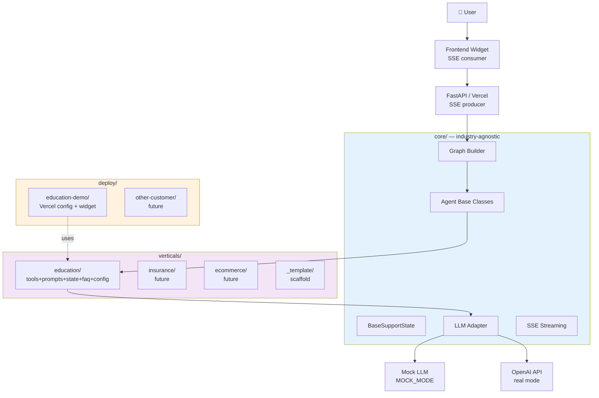
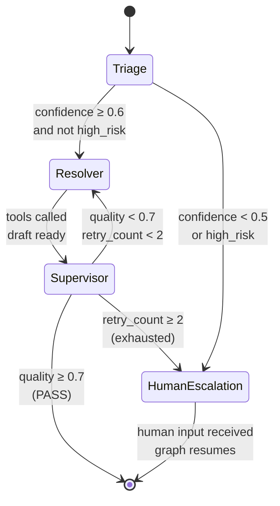
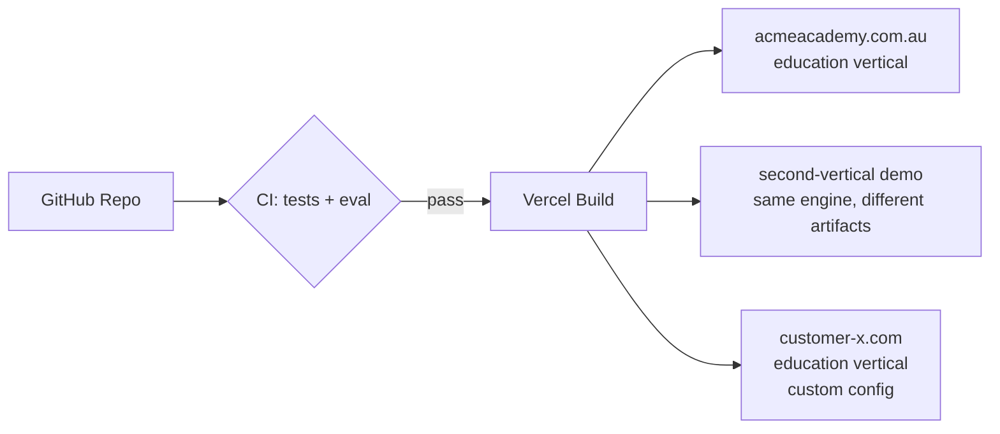

# Architecture — LangGraph Multi-Vertical Customer Workflow Platform

**Audience:** Senior engineers, technical interviewers, vertical authors, integration partners
**Reading time:** 15 minutes
**Status:** v1.0 (Education vertical)

---

## 1. Design Goals

1. **Strict separation between `core/` (engine) and `verticals/` (domain)** — verticals can be added without touching core
2. **2-day vertical authoring time** — a new industry vertical is a directory of declarative artifacts (tools, prompts, FAQ, config), not custom engine code
3. **Multiple LLM providers via adapter pattern** — Mock LLM for tests/demos, OpenAI today, easy to add Anthropic/Mistral later
4. **Production-ready deployment** — Vercel-compatible Python serverless, MOCK_MODE-by-default so public demos cost nothing
5. **Eval-driven** — every vertical ships with a 30-scenario eval harness; CI gates resolution rate ≥ 70%

### Why multi-vertical (and why the abstraction was worth the upfront cost)

Customer-service workflows in education, insurance, retail, allied health, real-estate and telco-style B2C tier-1 support share the same control flow:

> `classify → look up → decide → draft → quality-check → escalate-or-finish`

What changes between industries:

| Layer | Education | Insurance | Retail | Healthcare |
|-------|-----------|-----------|--------|------------|
| **Tools** | `lookup_subscription`, `calculate_prorated_refund` | `lookup_policy`, `calculate_claim_estimate` | `lookup_order`, `process_return` | `book_appointment`, `verify_eligibility` |
| **High-risk keywords** | "lawyer", "complaint", "child struggling" | "ombudsman", "fraud", "policy dispute" | "chargeback", "consumer affairs" | "emergency", "ED", "worse" |
| **Allowed intents** | 10 pricing / refund / family flows | 8 claim / policy / billing flows | 9 order / return / dispute flows | 7 booking / billing / triage flows |
| **Escalation receivers** | Teacher, tutoring coordinator | Claims officer, complaints team | Returns supervisor, fraud team | Nurse, clinic manager, on-call |

The engine logic — interrupts, state, retry loops, quality gating, SSE streaming — does not change. A monolithic chatbot codebase would duplicate the engine per industry. The vertical abstraction makes that duplication impossible by construction.

The cost is roughly 15–20% extra design effort upfront (the vertical contract, the AST layering test, the adapter pattern). The payoff is a new vertical in ~16 hours of focused work instead of a multi-week fork.

---

## 2. High-Level Architecture



---

## 3. Agent Graph (per request)



**Nodes:**
- **Triage** — classifies intent, urgency, extracts entities; sets `requires_human` flag
- **Resolver** — selects and calls tools (function calling); composes draft response
- **Supervisor** — scores draft (`quality_score: 0..1`); routes back to Resolver if < 0.7
- **HumanEscalation** — `interrupt_before` LangGraph node; pauses, awaits human input via API

**Conditional routing functions** (see `core/graph_builder.py`):
```python
def route_after_triage(state):
    if state["requires_human"] or state["confidence"] < 0.5:
        return "human_escalation"
    return "resolver"

def route_after_supervisor(state):
    if state["quality_score"] >= 0.7:
        return END
    if state["retry_count"] >= 2:
        return "human_escalation"
    return "resolver"
```

---

## 4. State Design

```python
# core/state.py — industry-agnostic base

class BaseSupportState(TypedDict):
    # Conversation
    messages: Annotated[list, add_messages]
    session_id: str
    customer_id: str

    # Triage outputs
    intent: str               # vertical defines allowed values
    confidence: float         # 0..1
    urgency: Literal["low", "medium", "high"]

    # Resolver outputs
    draft_response: str
    tools_called: list[str]
    tool_results: dict[str, Any]

    # Supervisor outputs
    quality_score: float
    quality_feedback: str
    final_response: str
    citations: list[dict]

    # Control flow
    retry_count: int
    requires_human: bool
    human_decision: str
    resolved: bool
```

Each vertical may **extend** this state:

```python
# verticals/education/state.py

class EducationState(BaseSupportState):
    student_id: str | None
    subscription_id: str | None
    plan_code: str | None        # "M1", "M3", "M4", "M5"
    year_level: int | None
```

---

## 5. Vertical Module Contract

A vertical is a Python package that exports:

```python
# verticals/<name>/__init__.py
from .tools import TOOLS                    # list[BaseTool]
from .prompts import PROMPTS                 # dict[str, str]
from .state import StateClass                # subclass of BaseSupportState
from .graph import build_graph               # callable -> CompiledGraph

VERTICAL = {
    "name": "education",
    "display_name": "Education / Tutoring",
    "tools": TOOLS,
    "prompts": PROMPTS,
    "state_class": StateClass,
    "build_graph": build_graph,
    "faq_path": "verticals/education/data/faq.md",
    "config_path": "verticals/education/config.yaml",
}
```

The core graph builder consumes this contract. Verticals NEVER import from `core/api/` or other verticals.

**Dependency rules:**
```
verticals/* may import from: core/*
core/* may import from: standard lib + 3rd party packages only
deploy/* may import from: core/* and verticals/*
```

Enforced by:
- Convention (documented in `VERTICAL-AUTHORING-GUIDE.md`)
- Lint check (script: `scripts/check_layering.py`)
- Monitor in monitoring script (run as part of CI)

---

## 6. LLM Provider Adapter

```python
# core/llm/base.py
class BaseLLMProvider(Protocol):
    async def complete(self, messages: list[dict], tools: list[dict] | None = None) -> dict: ...
    async def stream(self, messages: list[dict], tools: list[dict] | None = None) -> AsyncIterator[dict]: ...

# core/llm/mock.py — for MOCK_MODE + tests
class MockLLMProvider(BaseLLMProvider):
    def __init__(self, scenarios: dict): ...

# core/llm/openai_client.py — for real mode
class OpenAILLMProvider(BaseLLMProvider): ...
```

**Mode selection** (in `core/llm/__init__.py`):
```python
def get_llm_provider(vertical_config):
    if not os.getenv("OPENAI_API_KEY"):
        return MockLLMProvider(load_mock_scenarios(vertical_config))
    return OpenAILLMProvider(model=os.getenv("LLM_MODEL", "gpt-4o-mini"))
```

This is the same pattern an earlier deploy used successfully.

---

## 7. API Surface

```
POST /api/chat
  body: { message: str, session_id: str, customer_id: str, vertical: str }
  response: SSE stream
    event: thread     {"thread_id": "..."}
    event: triage     {"intent": "...", "confidence": 0.9}
    event: tool_call  {"tool": "lookup_subscription", "args": {...}}
    event: tool_result {"tool": "lookup_subscription", "result": {...}}
    event: token      {"delta": "..."}
    event: citations  {"citations": [...]}
    event: done       {"latency_ms": 420, "tokens": 134, "mode": "mock"|"real"}

POST /api/resume
  body: { thread_id, human_decision }
  → resumes paused graph (Human-in-the-loop)

GET /api/pending-human
  → list of sessions awaiting human input

GET /api/health
  → status, mode, loaded verticals, config

POST /api/eval
  body: { vertical: str, dataset: str|null }
  → runs eval harness, returns metrics JSON
```

**Why SSE not WebSocket:** single-direction streaming (server→client), HTTP/1.1 friendly, native browser support without library, lower complexity. Same decision rationale as an earlier deploy (documented in ADR-001).

---

## 8. Critical Design Decisions

### 8.1 Why verticals are directories not classes

Considered: a `Vertical` Python base class with subclasses (`EducationVertical(Vertical)`).
**Rejected.** Reason: that forces vertical authors to know Python class inheritance. Target authors are 1) internal developers (Python literate) 2) future platform customers (may not be coders).

Directory-of-files approach means a vertical is **declarative artifacts** (YAML config, markdown FAQ, JSON mock data) + thin Python adapters. A non-coder can copy `_template/`, edit `config.yaml`, and have a working vertical.

### 8.2 Why mock LLM, not a real model in test mode

OpenAI rate limits, costs, and latency make CI tests unreliable. Mock LLM uses a `mock_responses.json` (vertical-provided) for deterministic behaviour. Tests run in < 5 seconds.

### 8.3 Why no agent framework above LangGraph (no AutoGen, CrewAI)

LangGraph already provides state, routing, interrupts. Adding another layer creates accidental complexity. We use raw LangGraph and document the patterns in `docs/LANGGRAPH-DESIGN.md`.

### 8.4 Why FastAPI not Flask / Litestar

FastAPI: type-safe, async-native, OpenAPI-out-of-box, Vercel Python runtime tested. Same engine an earlier deploy uses. Lower context-switch cost.

### 8.5 Why Vercel for deploy

- Free tier sufficient for early customers
- Python 3.12 + Fluid Compute = no cold-start issues
- Auto-detects Python from `.py` extension (no runtime config in vercel.json)
- Same deployment model as an earlier deploy (deployment patterns reused)

### 8.6 Why `_template/` not `_skeleton/` or `_blank/`

Sorted-first in `ls` output (`_` < `a`). Authors see it immediately when entering `verticals/`. The underscore also conveys "internal/scaffolding".

---

## 9. Deployment Topology



Each deployment is a **deploy/<name>/** directory with its own:
- `vercel.json`
- `api/main.py` (thin Vercel entry — imports core + selects vertical)
- `widget.js` (branded for that customer)
- `.env.example` (vertical, OpenAI key, branding)

The same platform code serves multiple deploys via different vertical selections.

---

## 10. Failure Modes & Mitigation

| Failure Mode | Detection | Mitigation |
|--------------|-----------|------------|
| LLM hallucinates a price | Eval harness flags answers not in FAQ | System prompt forbids price invention; Supervisor scores accuracy |
| Tool call loops infinitely | `retry_count` ≥ 2 → human escalation | Hard cap in `graph_builder` |
| OpenAI API down | Real → Mock fallback | LLM adapter detects 5xx, falls back |
| Vertical loads with missing tool | Graph build fails fast | `build_graph` validates tool registry at import |
| User session lost on Vercel cold start | `thread_id` in localStorage | Browser-side persistence (proven in an earlier deploy) |
| Vertical author breaks core | Layering lint catches imports | `scripts/check_layering.py` runs in CI |

---

## 11. Roadmap (Engine-level)

| Version | Engine feature | Verticals |
|---------|---------------|-----------|
| v1.0 (now) | Single graph per vertical, single LLM | Education |
| v1.1 | Multi-LLM routing (cheap for Triage, premium for Resolver) | Second-vertical demo |
| v1.2 | Long-term memory (Redis-backed) | E-commerce |
| v1.3 | Customer-portal vertical authoring UI | Real-estate |
| v2.0 | Multi-tenant hosting + per-tenant isolation | Allied health, fitness |

---

## 12. References

- LangGraph docs: https://langchain-ai.github.io/langgraph/
- LangGraph: https://langchain-ai.github.io/langgraph/
- FastAPI: https://fastapi.tiangolo.com/
- Vercel Python runtime: https://vercel.com/docs/functions/runtimes/python

---

*v1.0 — May 2026*
