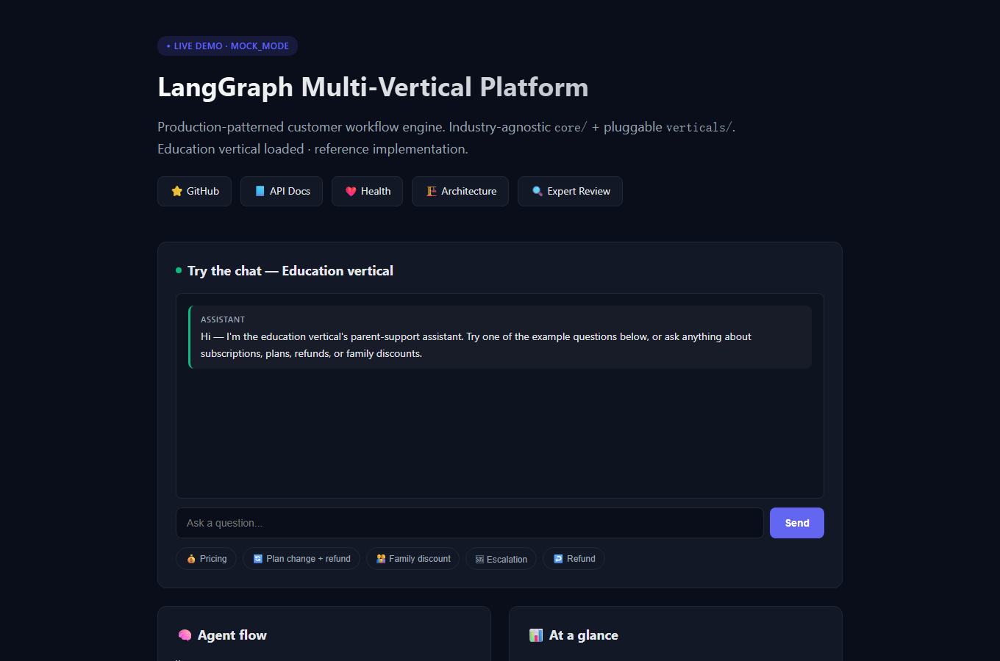

# LangGraph Multi-Vertical Customer Workflow Platform

> Production-patterned multi-agent AI customer workflows with industry-pluggable verticals.
> Built on **LangGraph** + **FastAPI** + **OpenAI** · Deployed on **Vercel**
>
> 🌐 **Live demo:** [langgraph-platform-demo.vercel.app](https://langgraph-platform-demo.vercel.app)

**Reviewing this repo? 10-minute tour:**
1. *(1 min)* Click the [live demo](https://langgraph-platform-demo.vercel.app) and fire an example question — watch the SSE events stream (`triage → tool_call → token → done`).
2. *(3 min)* Read [`tests/test_layering.py`](tests/test_layering.py) — an AST-based CI test that fails the build if any industry vocabulary leaks into `core/`. It's the architectural guarantee behind the multi-vertical claim.
3. *(3 min)* Skim [`EXPERT-REVIEW.md`](EXPERT-REVIEW.md) — an adversarial review I commissioned against my own v1 (5 blockers, 10 quick wins) and its resolution log.
4. *(3 min)* Run it yourself: `MOCK_MODE` needs no API key — see [Quick Start](#quick-start-60-seconds), then `python -m eval.run_eval --vertical education` to reproduce [`eval/EVAL-RESULTS.md`](eval/EVAL-RESULTS.md).

[](https://github.com/Star4future/langgraph-platform/actions/workflows/ci.yml)
[]()
[]()
[]()
[]()
[]()

[](https://langgraph-platform-demo.vercel.app)

---

## What This Is

A **multi-agent AI workflow engine** with a strict separation between an industry-agnostic core and pluggable vertical modules.

- **Core engine:** Triage → Resolver → Supervisor → Human-in-the-loop, with state machine, conditional routing, retry loops, and SSE streaming
- **Vertical = directory of artifacts:** tools.py, prompts.py, state.py, config.yaml, faq.md
- **Time to author a new vertical:** ~2 days (see `VERTICAL-AUTHORING-GUIDE.md`)
- **First vertical:** `education/` — an Australian tutoring customer-support use case used as the reference implementation

---

## Why This Exists

Customer support workflows across most industries follow the same shape:

```
classify intent  →  look up records  →  make a decision  →
draft reply  →  quality-check  →  escalate when uncertain
```

The *plumbing* (state machine, routing, retry, human-in-the-loop, streaming) is identical industry to industry — what changes is the **tools, prompts, FAQ, and business rules**. Yet most production chatbots bake the industry assumptions deep into the engine, so moving to a new industry means a fork or rewrite.

This platform separates the plumbing (`core/`) from the industry artifacts (`verticals/`) and enforces the separation with an AST-based layering test in CI. A single engine serves materially different businesses without code forks.

### Industries the same architecture fits

| Industry | Example workflows handled by this shape |
|----------|----------------------------------------|
| **Education / tutoring** | Subscription lookup, plan changes, prorated refunds, family discounts, teacher escalation |
| **Insurance / financial services** | Policy lookup, claim filing, premium calculation, callback scheduling, complaint escalation |
| **Retail / e-commerce** | Order status, returns and exchanges, loyalty tier upgrades, dispute escalation |
| **Allied health / clinics** | Appointment booking, billing queries, intake triage, urgent-symptom escalation |
| **Property / real-estate** | Listing inquiries, application status, inspection scheduling, tenant escalation |
| **Large B2C retail / telco** | Tier-1 support deflection, account changes, churn-save offers, supervisor handoff |

The `education/` vertical is the reference implementation, built end-to-end with 8 tools, 30 eval scenarios, 40 FAQ entries, and a working Vercel deployment. Other industries slot in via the same six-file vertical contract (`tools.py`, `prompts.py`, `state.py`, `config.yaml`, `data/faq.md`, `data/mock_responses.json`) — see [`VERTICAL-AUTHORING-GUIDE.md`](VERTICAL-AUTHORING-GUIDE.md) for the step-by-step.

---

## Quick Start (60 seconds)

```bash
# 1. Clone & install
git clone https://github.com/Star4future/langgraph-platform
cd langgraph-platform
pip install -r requirements.txt

# 2. Set vertical + run (MOCK_MODE — no API key needed)
export VERTICAL=education
uvicorn core.api.main:app --reload --port 8000

# 3. Test the chat
curl -N -X POST http://localhost:8000/api/chat \
  -H "Content-Type: application/json" \
  -d '{"message":"I want to switch from M3 to M4 and refund the difference","session_id":"demo","customer_id":"parent_001"}'
```

You'll see SSE events stream back: `triage` → `tool_call` → `tool_result` → `token` → `done`.

---

## Architecture (10-second version)

```
┌─────────────────────────────────────────────────┐
│  core/   — industry-agnostic engine             │
│  ├── agents/  (triage, resolver, supervisor)    │
│  ├── graph_builder.py                            │
│  ├── llm/     (mock + openai adapters)           │
│  └── api/     (FastAPI + SSE)                    │
├─────────────────────────────────────────────────┤
│  verticals/  — plug-in industry modules         │
│  ├── education/   ← reference vertical           │
│  ├── _template/   ← copy this for new industry   │
│  └── (insurance/, ecommerce/, etc.)              │
├─────────────────────────────────────────────────┤
│  deploy/   — per-deploy configuration            │
│  └── education-demo/  ← Vercel + custom widget   │
└─────────────────────────────────────────────────┘
```

See `ARCHITECTURE.md` for full diagrams and design decisions.

---

## What's in v1

✅ Core engine (Triage / Resolver / Supervisor / Human-in-the-loop)
✅ Education vertical (8 mock tools, AU-localised prompts, 40-Q FAQ)
✅ Vercel deployment config (education-demo)
✅ Eval harness (30 scenarios, 6 metrics)
✅ Mock LLM for zero-cost demos
✅ SSE streaming widget
✅ Vertical authoring guide
✅ Full unit + integration tests
✅ Durable HITL — set `CHECKPOINT_DATABASE_URL` to back the checkpointer with Postgres so paused escalations survive restarts (demos fall back to in-memory)

🔜 v1.1 — Second reference vertical (validation that the 2-day vertical-authoring claim is real)
🔜 v1.2 — Multi-LLM routing (cheap Triage, premium Resolver)
🔜 v1.3 — Long-term memory (Redis)

---

## Performance & Eval

Latest education vertical eval run — 30 scenarios, MOCK_MODE, reproducible with
`python -m eval.run_eval --vertical education` (full report: [`eval/EVAL-RESULTS.md`](eval/EVAL-RESULTS.md)):

| Metric | Value | Threshold | Status |
|--------|-------|-----------|--------|
| Resolution rate | 100% | ≥ 70% | ✓ |
| Intent accuracy | 100% | ≥ 85% | ✓ |
| Tool choice accuracy | 90% | ≥ 80% | ✓ |
| Human-escalation precision | 97% | ≥ 90% | ✓ |
| Avg quality score | 0.82 | ≥ 0.70 | ✓ |
| P50 latency (mock) | 194 ms | ≤ 3s | ✓ |

> These are **deterministic mock-mode numbers**: they verify the pipeline — routing,
> tool dispatch, escalation, retries, judge — against a fixed scenario set, the same
> way the CI gate does. They are not a claim about live-LLM answer quality; that
> benchmark (`MOCK_MODE=false`) is tracked separately.

---

## Repository Layout

```
langgraph-platform/
├── ARCHITECTURE.md           ← technical architecture + design decisions
├── VERTICAL-AUTHORING-GUIDE.md  ← author new industry in 2 days
├── README.md                 ← this file
├── EXPERIENCE-LOG.md         ← lessons from 0→1 (replicable knowledge)
│
├── core/                     ← industry-agnostic engine
├── verticals/                ← industry modules (education, _template)
├── deploy/                   ← per-deploy configuration
├── eval/                     ← scenarios + harness + reports
├── tests/                    ← unit + integration
└── docs/                     ← QUICKSTART, LANGGRAPH-DESIGN, DEPLOYMENT-GUIDE
```

---

## Deployment

```bash
# Deploy to Vercel (production)
cd deploy/education-demo
vercel --prod

# Health check
curl https://your-deploy.vercel.app/api/health
```

See `docs/DEPLOYMENT-GUIDE.md`.

---

## Authoring a New Vertical

```bash
# 1. Copy template
cp -r verticals/_template verticals/insurance

# 2. Fill in
#    - tools.py     (5-10 domain functions)
#    - prompts.py   (Triage / Resolver / Supervisor system prompts)
#    - state.py     (extend BaseSupportState with vertical fields)
#    - config.yaml  (business rules: escalation thresholds, etc.)
#    - data/faq.md  (30-50 Q&A)

# 3. Add to verticals/__init__.py registry

# 4. Run eval
python -m eval.run_eval --vertical insurance

# Total time: 2 days
```

Full step-by-step in `VERTICAL-AUTHORING-GUIDE.md`.

---

## License

MIT — see `LICENSE`.

---

## Background

Designed for and validated against an Australian education customer-support use case where a simpler Q&A bot (OpenAI Assistants API + File Search) hit a complexity ceiling for multi-step service requests (refunds, plan switches, family discount application, escalations). LangGraph + a multi-agent graph became the natural next step; structuring it as a platform with a clean `core/` ↔ `verticals/` split keeps the engine reusable across domains.

The pattern transfers cleanly to insurance claims processing, loan workflow automation, allied-health booking, or order-dispute resolution — the domain is just configuration.

---

*Built by [@Star4future](https://github.com/Star4future) · May 2026 · MIT licensed*
